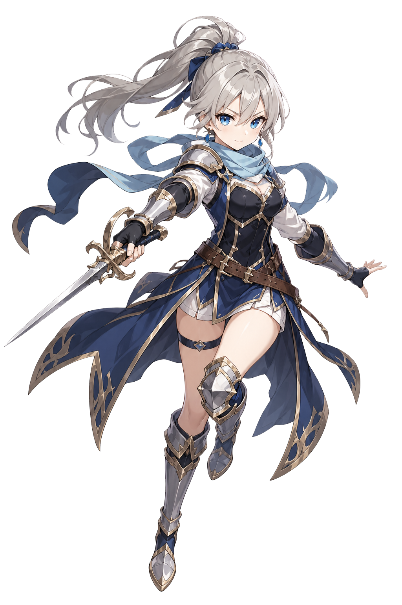
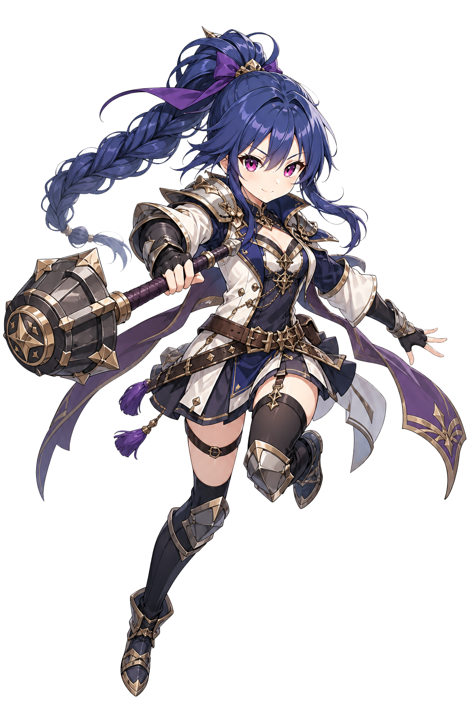
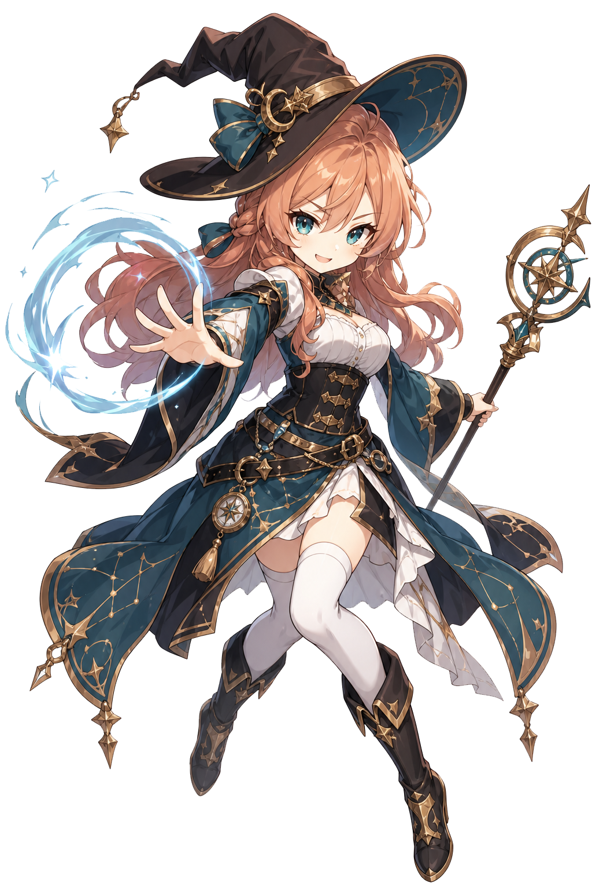
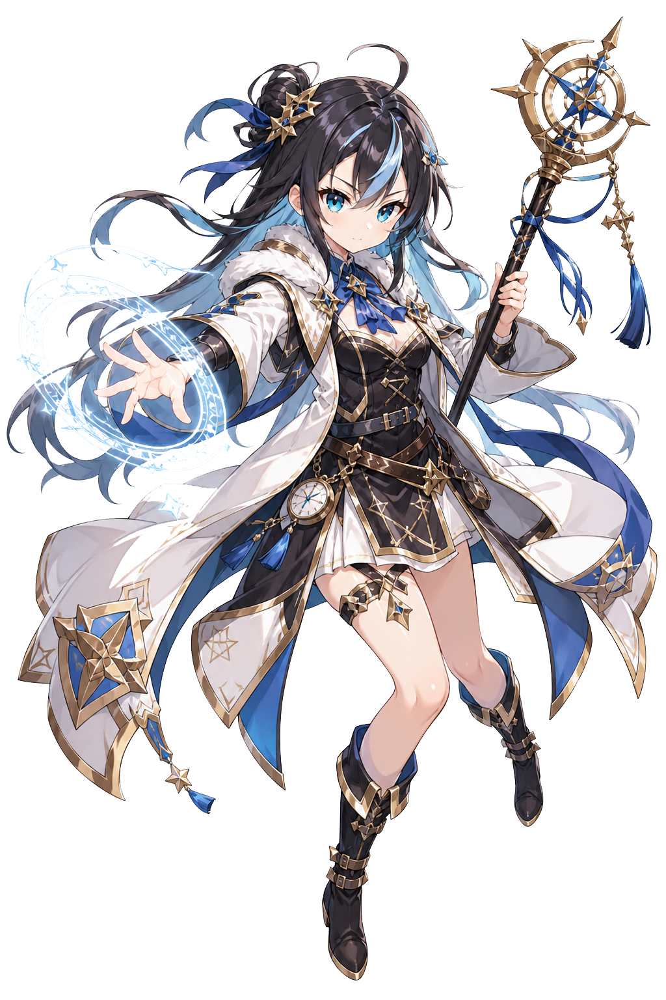
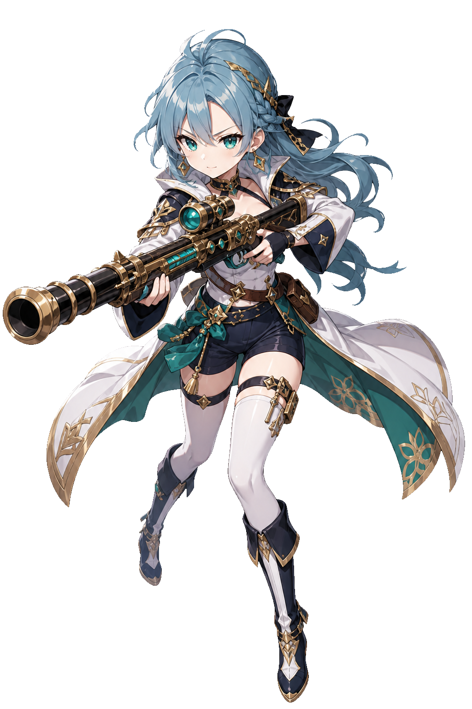
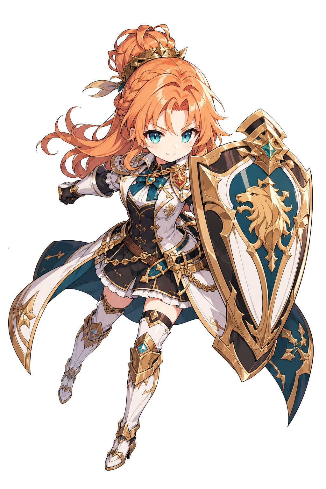

<div align="center">


</div>

---

## 📜 Character Sheet

```yaml
name: LMdev
class: Full-Stack Adventurer
origin: Santiago, Chile 🇨🇱
guild: Independent
languages: [Spanish (native), English (conversational)]
current_quest: "Migrating MiniDemons to the Godot 4 realm"
status: 🟢 Available for hire
```

I'm a developer with a solid foundation in **HTML, CSS and JavaScript**, currently venturing into **Godot 4** to build my own worlds. I also carry QA training (manual testing, Jira, ISTQB CTFL fundamentals) — think of it as my *scouting skill*: I find what's broken before it finds your players.

- 🎮 Building **MiniDemons**, an idle/clicker realm with 21 characters, deep progression systems, and lore in three tongues (ES/EN/JA)
- 🧪 QA-trained — test design, bug tracking in Jira, manual testing best practices
- 🌱 Currently grinding XP in Godot 4 / GDScript
- 💼 Open to freelance web dev, Godot prototyping, and QA testing quests

---

## ⚔️ Inventory (Tech Stack)

<div align="center">


</div>

---

## 📊 Guild Stats

<div align="center">


<br/>


</div>

---

## 🏰 Featured Realm

<div align="center">

<a href="#">

</a>

*An idle/clicker world of 21 demonias, ancient item systems, and lore whispered in three languages.*

</div>

---

## 🎴 Meet the Cast

<div align="center">

<table>
<tr>
<td align="center"><br/><b>Bethany</b></td>
<td align="center"><br/><b>Karina</b></td>
<td align="center"><br/><b>Cerulis</b></td>
</tr>
<tr>
<td align="center"><br/><b>Nanie</b></td>
<td align="center"><br/><b>Asolde</b></td>
<td align="center"><br/><b>Bastion</b></td>
</tr>
</table>

*A glimpse of the demonias awaiting in MiniDemons — each with their own lore, items, and story.*

</div>

---

## 🗺️ Find me across the realms

<div align="center">

<a href="https://www.fiverr.com/" target="_blank"></a>
<a href="https://www.upwork.com/" target="_blank"></a>

</div>

<div align="center">

</div>
